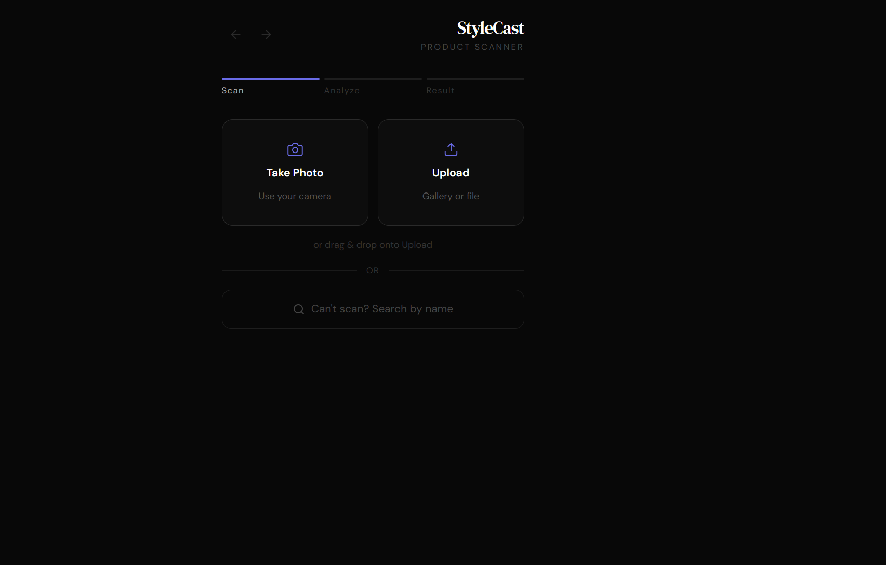
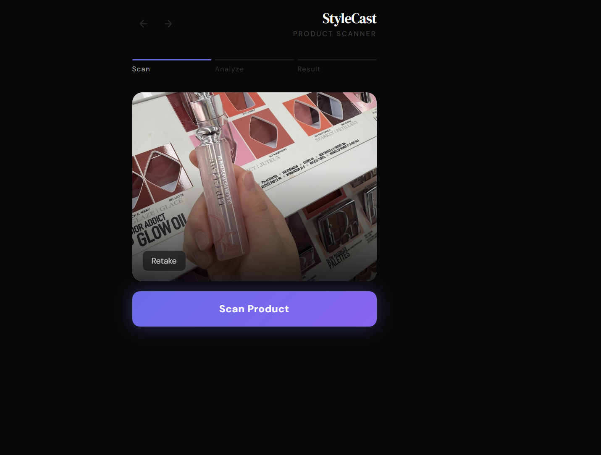
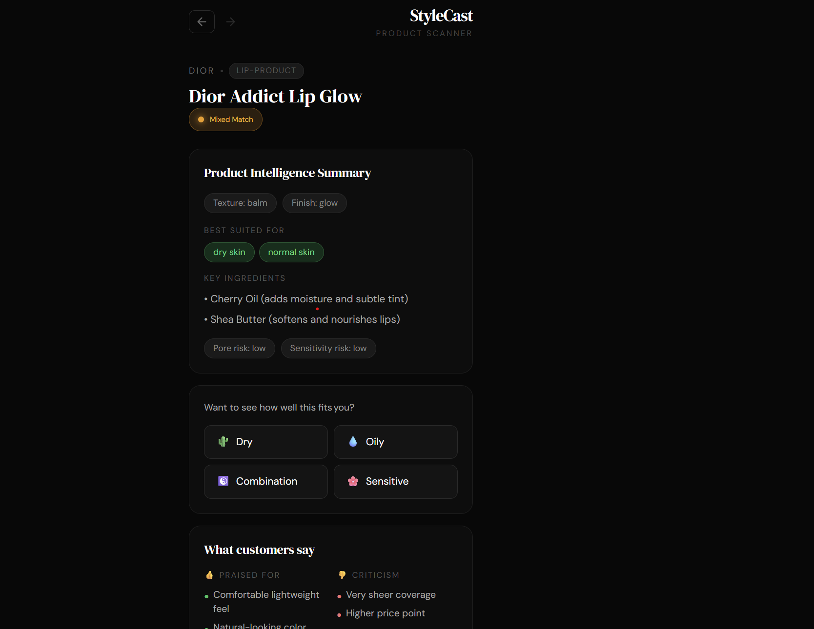
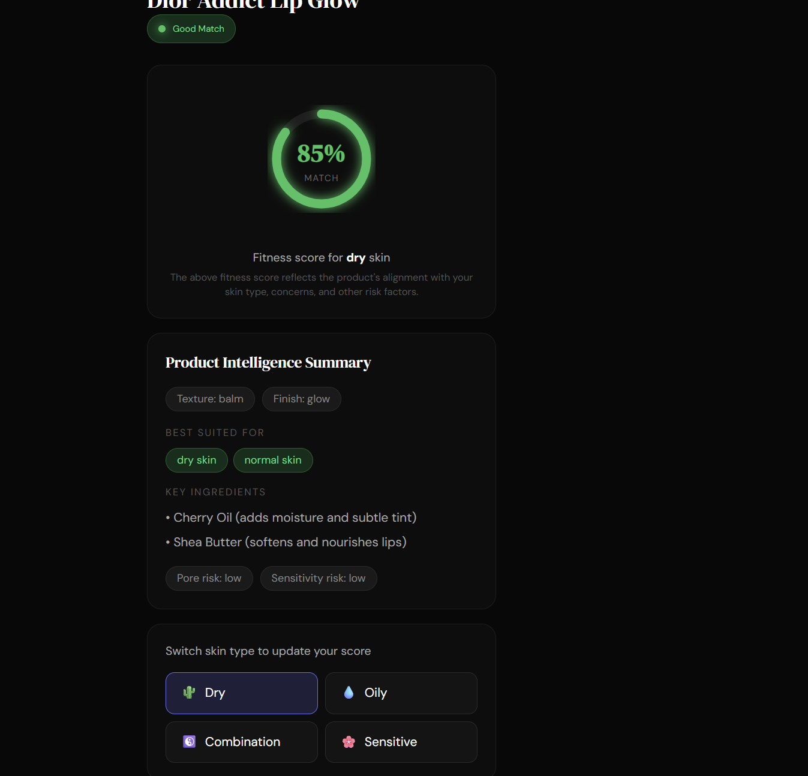
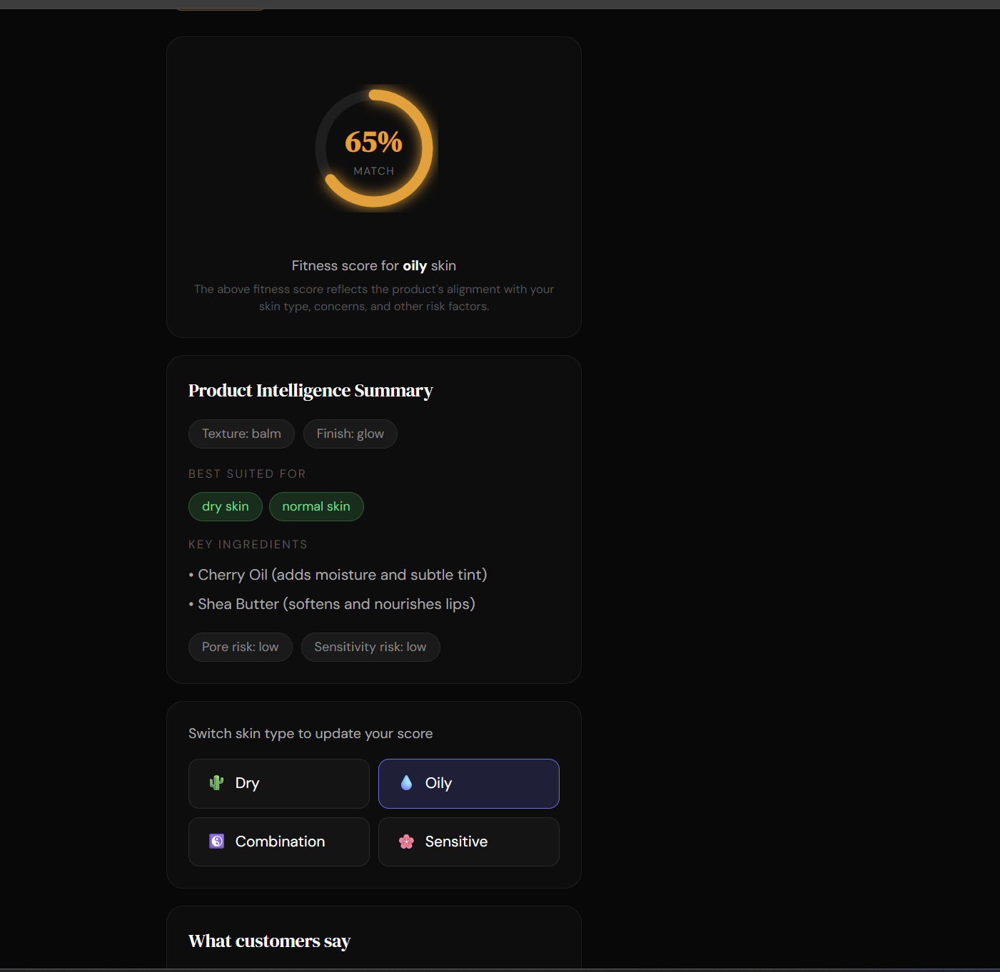
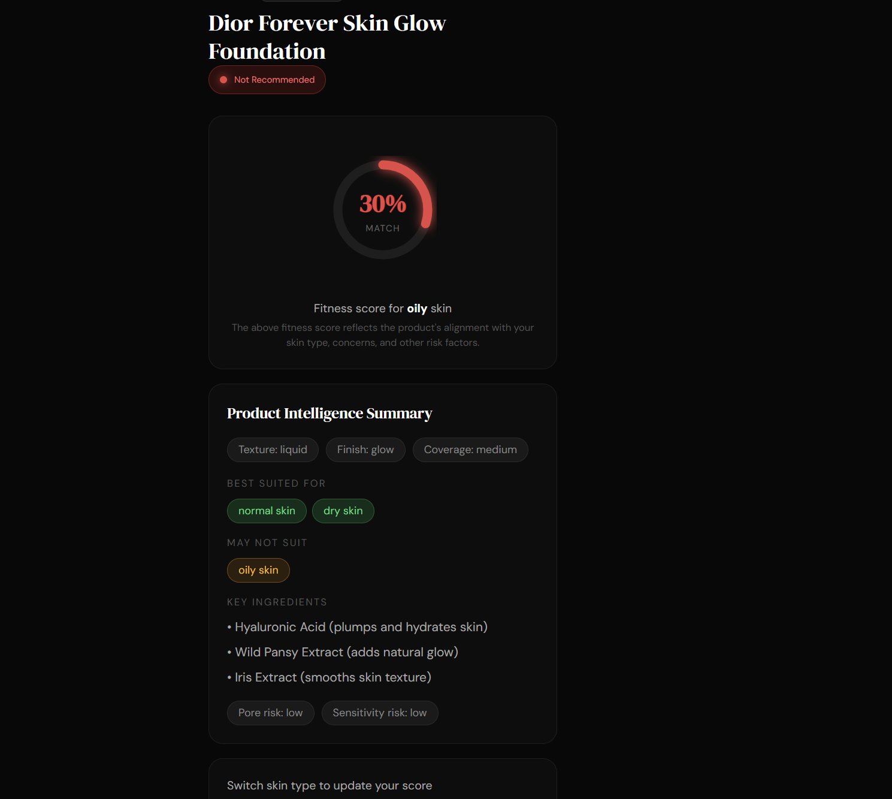
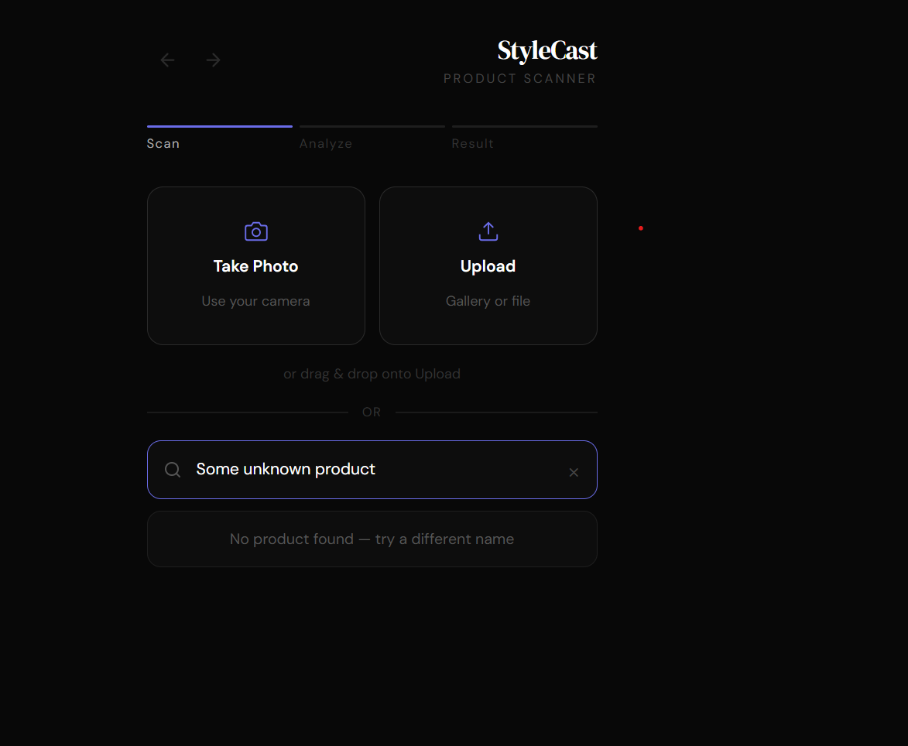
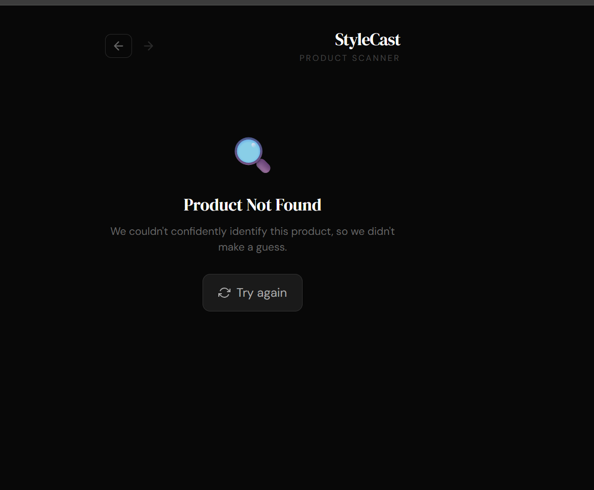
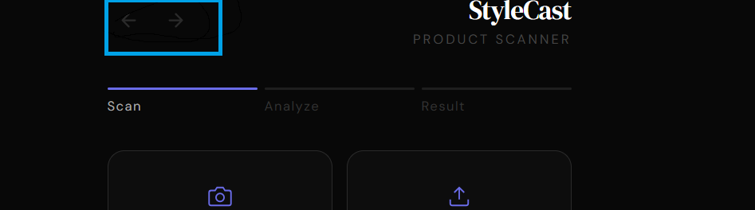

# Product Scanner

Product Scanner is a web application that identifies beauty products from a photo or name search, then delivers personalised product intelligence including ingredient breakdowns, skin compatibility scores, and curated alternatives.

---

## What it does

Simply point your device's camera at any product, upload a photo, or search a product by name. The product scanner reads the packaging, identifies the product, and tells you:

- What the key ingredients actually do.
- Whether the product suits your skin type, with a 0–100 fitness score.
- What customers consistently praise and criticise.
- Two alternatives from the same brand, with a clear explanation of how they differ.

If a product cannot be identified without ambiguity, product scanner says so rather than guessing.

---

## Supported products

The app currently covers 24 products across 3 brands:

- **Dior** — foundations, serums, moisturisers, lip products
- **Rare Beauty** — foundations, tinted moisturisers, lip products, primers
- **La Roche-Posay** — cleansers, moisturisers, serums, sunscreen

The full list of supported products can be found [here](https://docs.google.com/spreadsheets/d/1nCdNNC2St6VZhPKAihXhKjWCIZtfRBiIKh0OJhJ_-v0/edit?gid=0#gid=0)

---

## User workflows

### 1 - Scan a product

- Take a photo with your device's camera or upload a saved photo from your gallery.



- Tap **Scan Product** on the page.



The app uploads the image, runs text extraction, and matches it against the product database within seconds.



### 2 - Personalise with a skin type
Tap any skin type on the product information page to generate a personalised fit score (0–100) alongside a rationale explaining why.





### 3 - Search by name
Click **Can't scan? Search by name**, type at least 3 characters, and results appear instantly. 



---

### 4 - Product Not Found
If the product isn't in the database, the app returns information indicating that the product could not be detected, similar to the screenshot below:



## Navigation

The top-left back and forward arrows let you navigate between the scan screen and your last result without rescanning. Going back and then scanning a new product clears the forward history.



---
## Testing 
The app is deployed on Vercel at this [product-scanner-app](https://maximus-product-scanner.vercel.app/). Do try out some of the workflows!

## Local Development

### Prerequisites

- Node.js 18+
- Python 3.13+
- AWS CLI configured with valid credentials
- Terraform 1.x
- Docker

### Backend

```bash
# Deploy infrastructure
cd infra
terraform init
terraform apply

# Seed the product database
cd ..
python scripts/seed_products.py

# Enrich products with ingredient intelligence
python scripts/enrich_products.py --dry-run   # preview first
python scripts/enrich_products.py             # write to DynamoDB
```

### Frontend

```bash
cd frontend
npm install
```

Set your API endpoint in `src/constants.js`:
```js
export const API_ENDPOINT = "https://your-api-id.execute-api.us-east-1.amazonaws.com/prod/scan";
```

```bash
npm run dev       # local development
npm run build     # production build
vercel --prod     # deploy to Vercel
```

### Tests

```bash
# Unit tests
pytest -v
```

---

## Project structure

```
product-scanner/
├── core/
│   ├── app/
│   │   ├── handler.py          # Lambda entry point
│   │   ├── decision_engine.py  # Fit score + recommendation logic
│   │   └── constants.py        # Enums, config, UserProfile model
│   └── Dockerfile
├── frontend/
│   └── src/
│       ├── App.jsx             # Phase state + navigation
│       ├── constants.js        # API endpoint + skin types
│       └── components/
│           ├── ScanStep.jsx    # Camera, upload, name search
│           ├── LoadingState.jsx
│           ├── ResultView.jsx  # Full result page
│           ├── ui/             # Atoms: FitMeter, PillTag, etc.
│           └── icons/
├── infra/
│   └── main.tf                 # AWS infrastructure
    |__ variables.tf
    |__  outputs.tf
├── tests/
│   ├── test_compute_fit_score.py
│   ├── test_recommend.py
│   ├── test_lambda.py
└── scripts/
    ├── seed_products.py        # One-time DynamoDB seed
    └── enrich_products.py      # Claude-powered data enrichment
```
